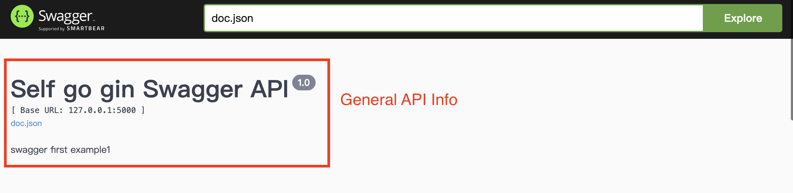
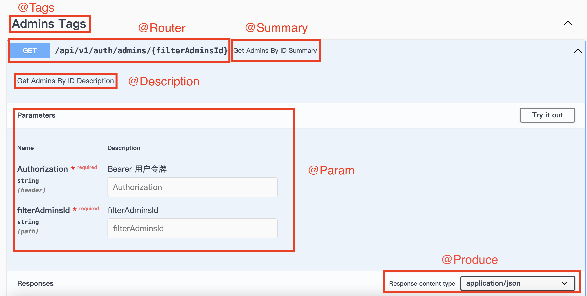
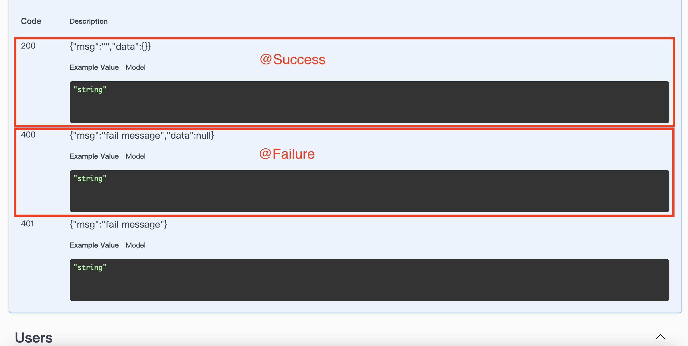

---
title: Gin-swagger
date: 2023-12-
categories:
- Golang
- Gin
tags:
- Golang
- Gin

--- 
# Gin-swagger API Docs
###### tags: `Golang` `Gin`
>製作者：Ericsiang

#### 參考 : 
[Gin框架中配置Swagger](https://blog.csdn.net/qq_41264401/article/details/130604881)

### 配置說明 
[gin-swagger gihub 文件說明](https://github.com/swaggo/gin-swagger)

#### 安裝 swag command
```
go install github.com/swaggo/swag/cmd/swag@latest
```
#### project 引入依賴
```
go get -u github.com/swaggo/gin-swagger

go get -u github.com/swaggo/files
```

#### 安裝 swag 
安裝 swag 完後，在 project folder 根目錄下執行指令，會自動建立 docs folder 以及相關檔案
```
swag init -g main.go 
```
```
docs
├── docs.go
├── swagger.json
└── swagger.yaml
```

#### gin 註冊 swagger router 
在 gin router 的地方，加入註冊 swagger router 

##### router.go
```
package route
import (
       "github.com/gin-gonic/gin"
	swaggerFiles "github.com/swaggo/files"
	ginSwagger "github.com/swaggo/gin-swagger"
	_ "{your project}/docs"
)

func Route(r *gin.Engine) {
	// global
	registerSwagger(r)
	// api
        r := r.Group("/api/v1")
        r.GET("/ping", func(c *gin.Context) {
		c.String(200, "pong "+fmt.Sprint(time.Now().Unix()))
	})
        return r
}

func registerSwagger(r *gin.Engine) {       
        //主要是這裡進行註冊 swagger router
	if gin.Mode() != gin.ReleaseMode {
	    r.GET("/swagger-test/*any", ginSwagger.WrapHandler(swaggerFiles.Handler))
	}
} 
```

### 建立 swagger 註解
在 main.go 新增 swagger 註解來設定 General API Info 參數 

>[註解定義可參考官方文件說明](https://github.com/swaggo/swag#declarative-comments-format)
[官方 main.go example](https://github.com/swaggo/swag/blob/master/example/celler/main.go)
[官方 api.go  example](https://github.com/swaggo/swag/blob/master/example/basic/api/api.go)




##### main.go
```
// General API Info 參數
// @title  Self go gin Swagger API
// @version 1.0
// @description swagger first example1
// @host localhost:5000
// @accept json
// @schemes http https
// @securityDefinitions.apikey	ApiKeyAuth
// @in			header
// @name   		Authorization
// @description Use Bearer {token}
func main() {
    r := gin.New()
    server:=router.Router(r)
    server.Run()
}
```


<table>
    <th>註解參數</th>
    <th>說明</th>
	<tr >
		<td>@title</td>
		<td>API 文件標題 (必填)</td>
	</tr>
    <tr >
		<td>@version</td>
		<td>API 文件版本號 (必填)</td>
	</tr>
    <tr >
		<td>@description</td>
		<td>API 文件描述</td>
	</tr>
    <tr >
		<td>@host</td>
		<td>API 文件網址</td>
	</tr>
    <tr >
		<td>@accept</td>
		<td>API 接收格式 Mime type</td>
	</tr>
    <tr >
		<td>@schemes</td>
		<td>格式 http https</td>
	</tr>
    <tr >
		<td>
            @securityDefinitions.{option}             </td>
    <td>
        安全機制<br><br>
        option : 
        <br>
            <li>basic</li>
            <li>apike</li>
            <li>oauth2</li>
        <br>
    </td>
	</tr>
</table>

設定 securityDefinitions 的參數，接在 securityDefinitions 後
<table>
    <th>註解參數</th>
    <th>說明</th>
	<tr >
		<td>@in</td>
		<td>
            通常設定為 header，表示會在 header 加參數
        </td>
	</tr>
    <tr >
		<td>@name</td>
		<td>參數名稱</td>
	</tr>
    <tr >
		<td>@description</td>
		<td>描述</td>
	</tr> 
</table>
   


 #### 依對應執行的 router handler func 前加 swagger 註解，來設定 API Operation 
 





##### EX:
 ```
 // @Summary  User Login
// @Description User Login
// @Tags Users
// @Accept json
// @Produce json
// @Param request body swagger_docs.DocUsersLogin true "request body"
// @Success 200 {string} json "{"msg": {"jwt_token": "JWT_TOKEN"},"data": null}"
// @Failure 400 {string} json "{"msg": {"fail": "帳密錯誤"},"data": null}"
// @Router /api/v1/users/login [post]
func UserLogin(context *gin.Context) {
    ...
}

 ```

       
<table>
    <th>註解參數</th>
    <th>說明</th>
	<tr >
		<td>@Summary</td>
		<td>可以當作是標題</td>
	</tr>
    <tr >
		<td>@Description</td>
		<td>描述</td>
	</tr>
    <tr >
		<td>@Tags</td>
		<td>將 API 用來分類</td>
	</tr>
    <tr >
		<td>@Accept</td>
		<td>API 接收的 Mime type</td>
	</tr> 
    <tr >
		<td>@Produce</td>
		<td>API 回應的 Mime type</td>
	</tr>
    <tr>
		<td>@Param</td>
		<td> 
        Param 參數格式 [ 參數名 Param_Type Data_Type 是否必須 註解 ] (中間都要空一格)
        <br>
        <br>
        Param Type
        <br>
        <li>query      => 參數帶在?後面 </li>
        <li> path      => 參數帶在網址路徑上</li>
        <li> header    => 在 header 加參數，</li>
        <li> body      => ex: json 格式</li>
        <li> formData  => form </li>
        <br>
        Data Type
        <br>
        <li>string (string)</li>
        <li>integer (int, uint, uint32, uint64)</li>
        <li>number (float32)</li>
        <li>boolean (bool)</li>
        <li>user defined struct</li>
        <br>
            
            
<pre>
// 在 header 加參數
// @Param Authorization header string true "Bearer 用户令牌"

// 自定義 user defined struct 且用 json 格式(body)
// @Param request body swagger_docs.DocUsersLogin true "request body" 

// 參數帶在網址路徑上
// @Param filterAdminsId path string true "filterAdminsId"
// @Router /api/v1/auth/admins/{filterAdminsId} [get] 
</pre> 
            
</td>
</tr> 
<tr>   
    <td>@Router</td>
    <td>
        API Path => 參數格式 [ path httpMethod ] </td>
    
</tr> 
</table>


#### 最後啟動 main.go，訪問 swagger API Docs 網址
> http://localhost/swagger-test/index.html
>  ([gin 註冊 swagger 步驟設定的 router ](#gin-註冊-swagger))

就可以在頁面上看到前面步驟設定的 General API Info 和各 API Operation 

## *有做任何更動都要執行 command，接著重新啟動 main.go，才會刷新 swagger 設定*

```
swag init -g main.go
```


### 將 swagger 檔案轉成 markdown 檔的工具
[go-swagger 的 Github](https://github.com/go-swagger/go-swagger)
[go-swagger 文檔說明](https://goswagger.io/install.html)
```
swagger generate markdown -f ./docs/swagger.yaml
```
預設是存成 markdown.md 檔，但可以透過參數指定設定輸出
```
swagger generate markdown -f ./docs/swagger.yaml --output=test.md 
```