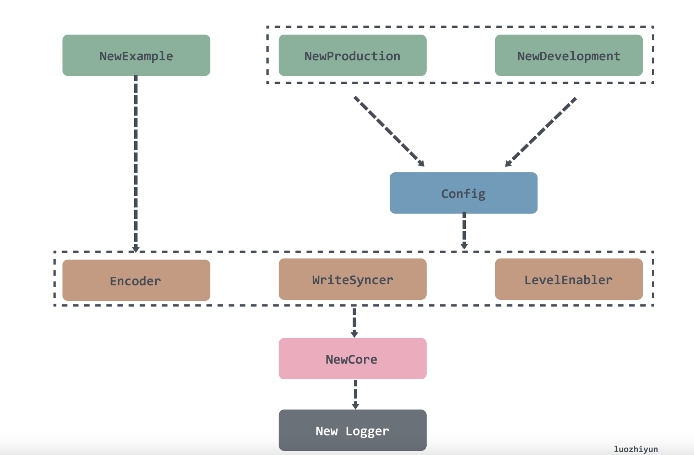
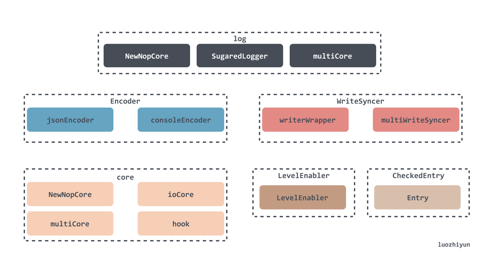
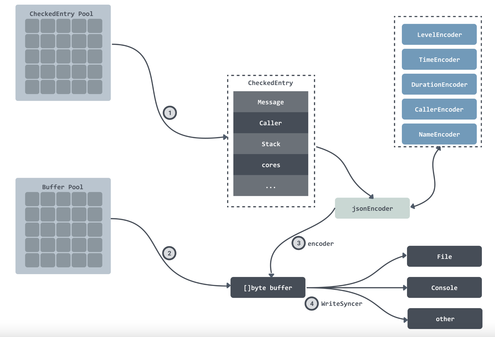

# Zap 日誌庫詳細運用
###### tags: `Golang` `Zap` `Logger`
>製作者：Ericsiang

### 參考
[高性能 Go 日志库 zap 设计与实现 ](https://www.cnblogs.com/luozhiyun/p/14885034.html)
[zap 接收 gin 框架默认的日志](https://juejin.cn/post/7034014982287130638)


### 下載 zap 套件
```
go get -u go.uber.org/zap  
```

### Zap Logger 的實例化流程圖
由圖可看出，組裝一個 zap.Logger 需要 zapcore.Core，而它又需要 Encoder、WriteSyncer、LevelEnabler




### 接口與框架設計圖




在程式碼結構設計上，透過簡單的介面封裝，實現了多種樣式的配置組合，從而滿足各種需求。 在最上層的設計上實現了三種 log 用來實現不同的功能：

**Logger**：使用較為繁瑣，只能使用結構化輸出，但效能較好；

**SugaredLogger**：可以使用 Printf 來輸出日誌，效能較 Logger 相比差 40% 左右；

**zapgrpc**：用做 grpc 的日誌輸出；

在設計上 Logger 可以很方便的轉換為 SugaredLogger 和 zapgrpc。 這幾個 Logger 需要傳入一個 Core 介面的實作類別才能建立。

* Encoder : 日誌輸出要存的編碼格式
    * zap 提供了 consoleEncoder、jsonEncoder，分別提供了 console 格式與 JSON 格式日誌輸出
    *  Encoder 還可以根據 EncoderConfig 的配置允许使用者靈活的配置日志的輸出格式
  
* WriteSyncer : 指定日誌寫到哪裡去，因此切割日誌功能是在此作設定
    * 使用 zapcore.AddSync(w io.Writer) 會得到 WriteSyncer
    * MultiWriteSyncer 可以直接設定多個 WriteSyncer
    
      **如想設定可以同時輸出到控制台和文件**
      
      writeSyncer  => 輸出到文件

      zapcore.AddSync(os.Stdout) => 輸出到控制台
      
      ```
       //可以設定成同時輸出到控制台和文件  
       zapcore.NewMultiWriteSyncer(writeSyncer,zapcore.AddSync(os.Stdout))
      ```
    
* LevelEnabler ： 哪種級別的日誌將被寫入
    * zap 的 級別
        ```
        const (
            // DebugLevel logs are typically voluminous, and are usually disabled in
            // production.
            DebugLevel Level = iota - 1
            // InfoLevel is the default logging priority.
            InfoLevel
            // WarnLevel logs are more important than Info, but don't need individual
            // human review.
            WarnLevel
            // ErrorLevel logs are high-priority. If an application is running smoothly,
            // it shouldn't generate any error-level logs.
            ErrorLevel
            // DPanicLevel logs are particularly important errors. In development the
            // logger panics after writing the message.
            DPanicLevel
            // PanicLevel logs a message, then panics.
            PanicLevel
            // FatalLevel logs a message, then calls os.Exit(1).
            FatalLevel

            _minLevel = DebugLevel
            _maxLevel = FatalLevel
        )
        ```
    * 可以透過 LevelEnablerFunc 設定級別規則
        ```
        infoLevel := zap.LevelEnablerFunc(func(lvl zapcore.Level) bool {
            return lvl >= zapcore.InfoLevel
        })

        errorLevel := zap.LevelEnablerFunc(func(lvl zapcore.Level) bool {
            return lvl >= zapcore.ErrorLevel
        })
        ```
* Core : 
    * zap 也提供了多種實現的選擇 NewNopCore 、ioCore、multiCore 、hook

* NewTee : 一次實現多個 core ，因此可以設置依不同 level 存放不同 log 路徑

* Entry：設定說完了，到了日誌資料的封裝。 首先日誌資料會封裝成一個 Entry，包含了日誌名稱、日誌時間、日誌等級，以及日誌資料等信息，沒有 Field 信息，然後經驗 Core 的 Check 方法對日誌等級校驗通過之後會產生一個 CheckedEntry 實例。

* CheckedEntry：包含了日誌資料所有訊息，包括上面提到的 Entry、呼叫堆疊資訊等。

### 打印日誌的過程




### 完整程式碼範例，包含 file-rotatelogs 切割日誌
```
package zapLogger

import (
	"errors"
	"os"
	"time"

	"github.com/gin-gonic/gin"
	rotatelogs "github.com/lestrrat-go/file-rotatelogs"
	"go.uber.org/zap"
	"go.uber.org/zap/zapcore"
)

type RotatelogsConfig struct {
	InfoLogPath   string
	ErrorLogPath  string
	MaxSize       int64
	RotationCount int64
	MaxAge        time.Duration
	RotationTime  time.Duration
}

type Logger struct {
	zapLogger *zap.Logger
}

func NewLogger(rotatelogsConfig *RotatelogsConfig) (*Logger, error) {
	zapLogger, err := initZap(rotatelogsConfig)
	if err != nil {
		return nil, err
	}

	zap.ReplaceGlobals(zapLogger) //使用全局logger(設定了在其他地方調用 zap.S() or zap.L() 才會生效)
	defer zapLogger.Sync()        // zap底层有缓冲。在任何情况下执行 defer logger.Sync() 是一个很好的习惯
	return &Logger{zapLogger: zapLogger}, nil
}

func (l *Logger) GetZapLogger() *zap.Logger {
	return l.zapLogger
}

func getFileRotatelogs(filePath string, rotatelogsConfig *RotatelogsConfig) (*rotatelogs.RotateLogs, error) {
	/*
		設定日誌輸出路徑，使用file-rotatelogs 進行切割
		MaxAge and RotationCount cannot be both set  兩者不能同時設置
		官方 github 上有說明建議使用 WithRotationCount，要將 MaxAge 設為 -1 比較保險
	*/

	logf, err := rotatelogs.New(filePath+".%Y%m%d",
		// rotatelogs.WithLinkName(filePath),      // 生成軟鏈，指向最新日誌文件
		rotatelogs.WithMaxAge(rotatelogsConfig.MaxAge),                     //保留舊日誌文件的最大天數
		rotatelogs.WithRotationTime(rotatelogsConfig.RotationTime),         //切割頻率為時間單位
		rotatelogs.WithRotationCount(uint(rotatelogsConfig.RotationCount)), //保留舊日誌文件最大保存個數
		rotatelogs.WithRotationSize(rotatelogsConfig.MaxSize),              //切割頻率為文件大小
		rotatelogs.WithHandler(rotatelogs.HandlerFunc(func(e rotatelogs.Event) {
			// 在這裡添加你的自定義操作
			if e.Type() == rotatelogs.FileRotatedEventType {
				// 這裡的代碼將在每次日誌切割時執行
				// e.(*rotatelogs.FileRotatedEvent).PrevFile() 是上一個日誌文件的路徑
				// e.(*rotatelogs.FileRotatedEvent).CurrentFile() 是當前日誌文件的路徑
			}

		})),
	)

	if err != nil {
		// log.Fatalln("zapLogger getFileRotatelogs()  err:", err)
		return nil, err
	}

	return logf, nil
}

func getNewCore(encoder zapcore.Encoder, logf *rotatelogs.RotateLogs, level zapcore.LevelEnabler) zapcore.Core {
	writeSyncer := zapcore.AddSync(logf)
	/*
		設定可以同時輸出到控制台和文件
		MultiWriteSyncer() => 一次輸出多個 WriteSyncer
		writeSyncer  => 輸出到文件
		zapcore.AddSync(os.Stdout) => 輸出到控制台
	*/
	return zapcore.NewCore(encoder, zapcore.NewMultiWriteSyncer(writeSyncer, zapcore.AddSync(os.Stdout)), level)
}

func customTimeEncoder(t time.Time, enc zapcore.PrimitiveArrayEncoder) {
	enc.AppendString(t.Format("2006-01-02 15:04:05"))
}

func getEncoderConfig() zapcore.EncoderConfig {
	encoderConfig := zapcore.EncoderConfig{
		TimeKey:        "time",   //日誌時間的key
		LevelKey:       "level",  //日誌級別的key
		NameKey:        "logger", //日誌名的key
		MessageKey:     "msg",    //日誌消息的key
		CallerKey:      "caller", //日誌調用函數的key
		StacktraceKey:  "trace",
		LineEnding:     zapcore.DefaultLineEnding,      //日誌結尾分隔符 - 默認/n
		EncodeLevel:    zapcore.CapitalLevelEncoder,    //日志级别，默認小寫，這裡設定為大寫
		EncodeTime:     customTimeEncoder,              //自訂日誌輸出時間格式 - customTimeEncoder()
		EncodeDuration: zapcore.SecondsDurationEncoder, //執行消耗的時間轉換成浮點型的秒
		EncodeCaller:   zapcore.ShortCallerEncoder,     //路径编码器
	}

	return encoderConfig
}

func getEncoder() zapcore.Encoder {
	encoderConfig := getEncoderConfig()

	var encoder zapcore.Encoder
	switch gin.Mode() {
	case gin.DebugMode:
		encoder = zapcore.NewConsoleEncoder(encoderConfig) //使用 console 格式
	case gin.ReleaseMode:
		encoder = zapcore.NewJSONEncoder(encoderConfig) //使用 json 格式
	default:
		encoder = zapcore.NewConsoleEncoder(encoderConfig) //使用 console 格式
	}

	return encoder
}

func getLevelEnabler() (infoLevel, errorLevel zap.LevelEnablerFunc) {
	infoLevel = zap.LevelEnablerFunc(func(lvl zapcore.Level) bool {
		return lvl >= zapcore.InfoLevel
	})

	errorLevel = zap.LevelEnablerFunc(func(lvl zapcore.Level) bool {
		return lvl >= zapcore.ErrorLevel
	})

	return infoLevel, errorLevel
}
func initZap(rotatelogsConfig *RotatelogsConfig) (*zap.Logger, error) {
	encoder := getEncoder()

	//依不同級別寫入不同文件
	infoLevel, errorLevel := getLevelEnabler()

	// info level log file
	infoLogf, err := getFileRotatelogs(rotatelogsConfig.InfoLogPath, rotatelogsConfig)
	if err != nil {
		infoLogfError := errors.New("[zapLogger] initZap() infoLogf err : " + err.Error())
		// log.Fatalln("zapLogger initZap() infoLogf err:", err)
		return nil, infoLogfError
	}
	infoCore := getNewCore(encoder, infoLogf, infoLevel)

	// error level log file
	errorLogf, err := getFileRotatelogs(rotatelogsConfig.ErrorLogPath, rotatelogsConfig)
	if err != nil {
		errorLogfError := errors.New("[zapLogger] initZap() errorLogf err : " + err.Error())
		return nil, errorLogfError
	}
	errorCore := getNewCore(encoder, errorLogf, errorLevel)

	teeCore := zapcore.NewTee([]zapcore.Core{infoCore, errorCore}...)

	return zap.New(teeCore, zap.AddCaller(), zap.AddCallerSkip(1)), nil // zap.AddCaller()为顯示文件名和行號，可省略
}


```